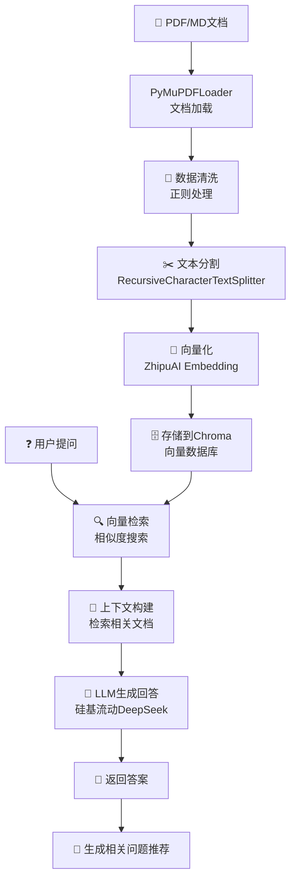

# RAG 知识库增强对话系统

基于 LangChain 和 Chroma 的检索增强生成（RAG）系统，支持PDF文档解析、向量化存储和智能问答。

## 🌟 项目特色

- 📚 **多格式文档支持**：PDF、Markdown 文档自动解析
- 🧠 **智能向量检索**：基于 Chroma 向量数据库的语义搜索
- 💬 **对话式交互**：支持连续对话和相关问题推荐
- 🔧 **灵活的模型接入**：支持智谱AI、硅基流动等多种LLM服务
- 🎯 **开箱即用**：完整的从文档处理到对话的端到端解决方案

## 📋 系统要求

- Python 3.8+
- 互联网连接（用于API调用）

## 🚀 快速开始

### 1. 环境配置

```bash
# 克隆项目
git clone <项目地址>
cd rag-project

# 安装依赖
pip install -r requirements.txt
```

### 2. API 密钥配置

在项目根目录创建 `.env` 文件：

```bash
# 智谱AI API密钥（用于Embedding）
ZHIPUAI_API_KEY=your_zhipuai_api_key

# 硅基流动API密钥（用于LLM）
SILICON_FLOW=your_siliconflow_api_key
```

**获取API密钥：**
- 智谱AI：访问 [智谱AI开放平台](https://open.bigmodel.cn/) 注册获取
- 硅基流动：访问 [硅基流动](https://siliconflow.cn/) 注册获取

### 3. 准备知识库文档

```bash
# 创建知识库目录
mkdir -p data_base/knowledge_db/your-document-folder

# 将PDF或Markdown文件放入该目录
# 当前示例使用速读相关的PDF文档
```

### 4. 构建向量数据库

```bash
# 修改 build_vec_db.py 中的文档路径
# folder_path = './data_base/knowledge_db/your-document-folder'

# 运行向量化脚本
python build_vec_db.py
```

### 5. 启动对话系统

```bash
python demo.py
```

## 📁 项目结构

```
rag-project/
├── demo.py                    # 🎯 主应用入口
├── build_vec_db.py           # 📦 向量数据库构建
├── data_proc.py              # 🔧 数据处理测试
├── ds_llm.py                 # 🤖 自定义LLM类
├── zhipuai_embedding.py      # 🧠 智谱AI嵌入实现
├── requirements.txt          # 📋 依赖列表
├── .env                      # 🔐 环境变量配置
├── data_base/
│   ├── knowledge_db/         # 📚 原始文档存储
│   └── vector_db/           # 🗄️ 向量数据库
└── test/
    ├── apitest.py           # 🧪 API连接测试
    └── embeddingtest.py     # 🧪 嵌入功能测试
```

## 🔄 系统工作流程



## 📊 核心组件详解

### 🔧 文档处理 (`build_vec_db.py`)

```python
# 主要功能：
# 1. 批量加载PDF/Markdown文档
# 2. 文本分割（chunk_size=500, overlap=50）
# 3. 向量化并存储到Chroma数据库
```

### 🤖 自定义LLM (`ds_llm.py`)

```python
# 支持的模型：
# - deepseek-ai/DeepSeek-V2.5（硅基流动平台）
# - 可扩展其他OpenAI兼容API
```

### 🧠 向量嵌入 (`zhipuai_embedding.py`)

```python
# 使用智谱AI的embedding-2模型
# 支持同步嵌入查询和文档批处理
```

### 💬 对话系统 (`demo.py`)

```python
# 核心功能：
# 1. RAG检索问答
# 2. 相关问题推荐
# 3. 连续对话支持
# 4. 友好的用户界面
```

## 🛠️ 自定义配置

### 修改文档分割参数

```python
# 在 build_vec_db.py 中调整
text_splitter = RecursiveCharacterTextSplitter(
    chunk_size=500,      # 每个文档块的字符数
    chunk_overlap=50     # 重叠字符数
)
```

### 更换LLM模型

```python
# 在 ds_llm.py 中修改模型名称
model="deepseek-ai/DeepSeek-V2.5"  # 可替换为其他模型
```

### 调整检索参数

```python
# 在 demo.py 中修改
docs = vectordb.similarity_search(question, k=3)  # k为检索文档数量
```

## 🧪 测试说明

### API连接测试
```bash
python test/apitest.py
```

### 嵌入功能测试
```bash
python test/embeddingtest.py
```

### 文档处理测试
```bash
python data_proc.py
```

## ❓ 常见问题

### Q1: 如何添加新的文档格式支持？
A: 在 `build_vec_db.py` 中添加相应的 LangChain 文档加载器，如：
```python
elif file_type == 'txt':
    loaders.append(TextLoader(file_path))
```

### Q2: 如何优化检索效果？
A: 可以调整以下参数：
- 增加 `chunk_overlap` 提高上下文连续性
- 调整 `chunk_size` 平衡信息完整性和检索精度
- 增加检索文档数量 `k`

### Q3: 如何处理中文文档？
A: 系统已内置中文支持，包括：
- 中文文本分割优化
- 中文正则清洗
- 智谱AI中文嵌入模型

### Q4: 内存占用过高怎么办？
A: 可以采取以下措施：
- 减少单次处理的文档数量
- 降低 `chunk_size` 参数
- 分批构建向量数据库

## 🚧 系统限制

- 当前仅支持文本内容提取，不支持图表和图像
- 向量数据库采用本地存储，大量文档时建议使用云端方案
- API调用存在速率限制，大批量处理时需注意

## 🔮 未来规划

- [ ] 支持更多文档格式（Word、Excel等）
- [ ] 添加Web界面（Gradio/Streamlit）
- [ ] 支持图像和表格内容理解
- [ ] 集成更多LLM和嵌入模型
- [ ] 添加对话历史管理
- [ ] 支持多语言文档处理

## 📄 许可证

本项目基于 MIT 许可证开源。

## 🤝 贡献指南

欢迎提交 Issue 和 Pull Request！

---

**享受您的知识库对话体验！** 🎉